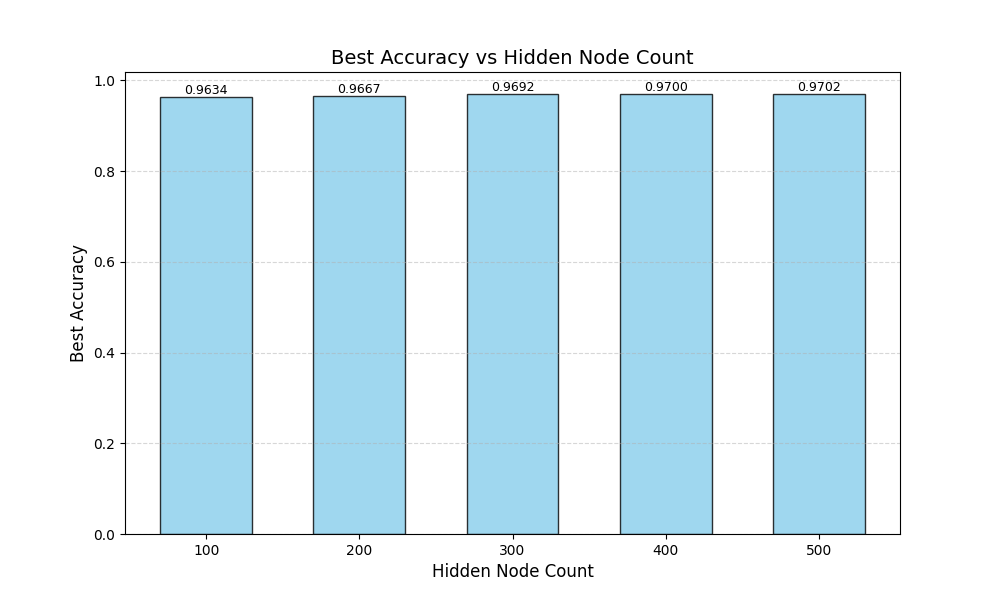
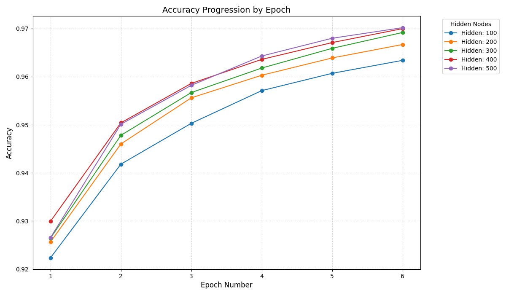
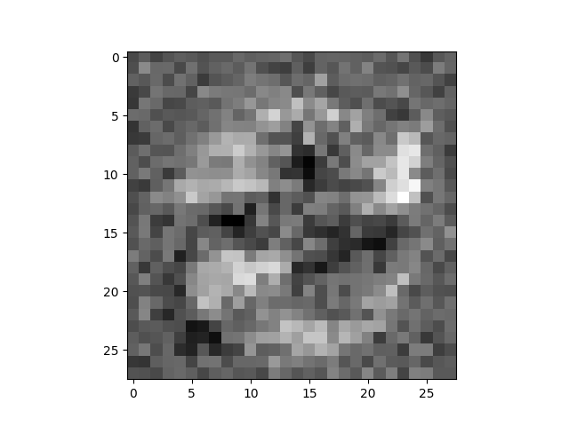

# Own MNIST Neural Network (from scratch)

This project implements a simple 3-layer (Input → Hidden → Output) neural network **from scratch** (NumPy-based) to classify handwritten digits from the MNIST dataset.

## Project Overview

- **Goal**: Classify MNIST digits (0–9).
- **Architecture**: 784 input nodes → \(N\) hidden nodes → 10 output nodes.
- **Core implementation**: Pure Python + NumPy for the network math (no deep learning frameworks).
- **Activation**: Sigmoid (`scipy.special.expit`), with an inverse sigmoid (`scipy.special.logit`) used for “backquery”.
- **Best observed accuracy (this repo’s latest run)**: **97.02%** (see `stats.json`).

## Repo Layout (key files)

- **`train.py`**: `NeuralNetworks` class + training/testing utilities + experiment drivers.
- **`data_preprocessing.py`**: CSV parsing + input/target normalization helpers.
- **`mnist_train.csv` / `mnist_test.csv`**: Training/test data used by scripts in this folder.
- **`stats.json`**: Recorded experiment results for varying hidden-layer sizes (and per-epoch accuracy).
- **Generated images**:
  - `epoch_vs_accuracy_combined.png`
  - `hidden_vs_best_accuracy.png`
  - `gen_input_image.png`

## Setup

From the repo root:

```bash
cd own-mnist
pip install numpy matplotlib scipy
```

Note: the scripts open data files like `mnist_train.csv` using **relative paths**, so running from inside `own-mnist/` is the easiest.

## How it Works

- **Forward pass**: `inputs → hidden → outputs` using matrix multiplies and sigmoid activation.
- **Training (backprop)**: Gradient descent updates for `wih` and `who`.
- **Testing**: `test_network(nn)` runs through `mnist_test.csv` and returns accuracy.
- **Backquery (generate an input for a target digit)**: `backquery(target_list)` approximately inverts the network to produce an input image that would yield a desired output distribution.

## Experiments & Usage

`train.py` includes a few entry points:

- **Train for a fixed configuration**: `train_network(...)` returns a trained network.
- **Sweep hidden-layer sizes + track accuracy per epoch**: `test_with_different_hidden_counts()` evaluates hidden sizes `[100, 200, 300, 400, 500]` for **6 epochs**, storing accuracy after each epoch.
- **Generate plots**: `generate_stats(stats)` writes `hidden_vs_best_accuracy.png` and `epoch_vs_accuracy_combined.png`.
- **Generate a “dreamed” digit input**: `generate_input(target_value)` writes `gen_input_image.png`.

To reproduce the hidden-size sweep and plots, uncomment the relevant lines near the bottom of `train.py` and run:

```bash
python train.py
```

## Results (latest `stats.json`)

### Best Accuracy vs Hidden Node Count

| Hidden nodes | Best accuracy |
|---:|---:|
| 100 | 0.9634 |
| 200 | 0.9667 |
| 300 | 0.9692 |
| 400 | 0.9700 |
| 500 | **0.9702** |



### Accuracy Progression by Epoch



### Backquery: Generated Input Image

This is an example “input image” generated by `backquery(...)` for a chosen target digit (the current script calls `generate_input(8)` by default):


